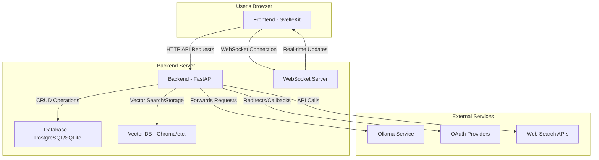
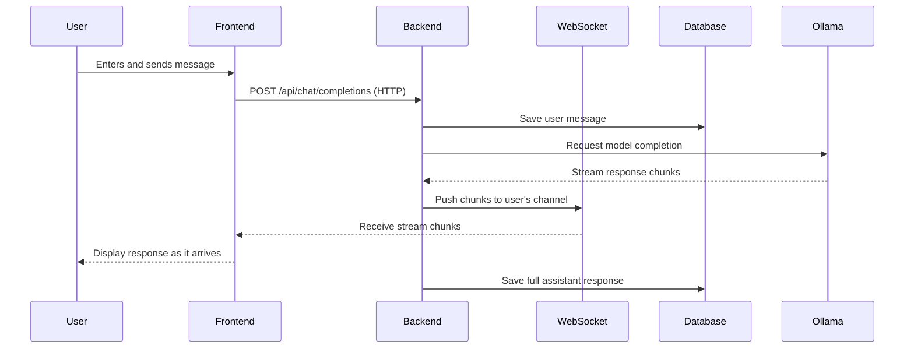
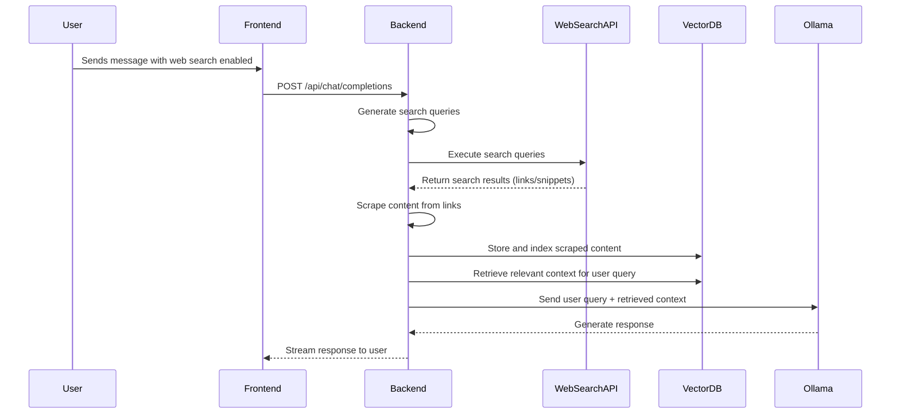

# Open-WebUI Project Summary

This document provides a high-level overview of the Open-WebUI project, including its frontend and backend architecture, key features, and data models.

## Frontend (SvelteKit)

The frontend is built with SvelteKit and is located in the `src` directory.

### Routing

The application's routes are defined in the `src/routes` directory. Key routes include:

-   `(app)`: The main application layout, which includes the sidebar and content area. It contains sub-routes for various features like admin, chat, channels, home, notes, playground, and workspace.
-   `auth`: Handles user authentication.
-   `error`: Displays error pages.
-   `s`: Likely used for shared content.
-   `watch`: For watching video content.

### Libraries and Utilities

The `src/lib` directory contains the frontend's core logic and utilities:

-   `apis`: API clients for backend communication.
-   `components`: Reusable Svelte components.
-   `i18n`: Internationalization and localization.
-   `pyodide`: A Pyodide worker for running Python in the browser.
-   `stores`: Svelte stores for state management.
-   `types`: TypeScript type definitions.
-   `utils`: Utility functions.
-   `workers`: Web workers for background tasks.

## Backend (FastAPI)

The backend is a FastAPI application located in the `backend` directory.

### Application Structure

The main application logic is in `backend/open_webui`:

-   `main.py`: The main entry point for the FastAPI application, defining API routes and middleware.
-   `routers/`: API routers for different resources (e.g., auth, chats, models).
-   `models/`: SQLAlchemy database models.
-   `internal/`: Internal utilities, including database connection management.
-   `migrations/`: Alembic database migrations.
-   `retrieval/`: Information retrieval, including vector databases and web search.
-   `socket/`: Socket.IO server for real-time communication.
-   `storage/`: Storage provider for file uploads.
-   `utils/`: Backend utility functions.

### Key Features

-   **Chat Interface:** Allows users to interact with AI models.
-   **User Authentication:** Supports user signup and sign-in.
-   **File Uploads:** Enables users to upload files.
-   **Information Retrieval:** Can retrieve information from vector databases and web search.
-   **Real-time Communication:** Uses Socket.IO for real-time frontend-backend communication.
-   **Extensibility:** Designed to be extensible with custom functions and tools.

## Data Models

The backend uses SQLAlchemy for its database models, which are defined in `backend/open_webui/models`. Key models include:

-   `Auth`: User authentication data.
-   `Channel`: Communication channels.
-   `Chat`: Chat history and metadata.
-   `Feedback`: User feedback on messages.
-   `File`: Uploaded files.
-   `Folder`: Folders for organizing chats.
-   `Function`: Custom functions.
-   `Group`: User groups for access control.
-   `Knowledge`: Knowledge bases for retrieval.
-   `Memory`: User-specific memories.
-   `Message`: Individual messages within a chat.
-   `Model`: AI models.
-   `Note`: User notes.
-   `Prompt`: Reusable prompts.
-   `Tag`: Tags for organizing chats.
-   `Tool`: Custom tools.
-   `User`: User accounts.

## Infrastructure and Logic Flow Diagrams

### High-Level Infrastructure

### Chat Completion Logic Flow

### RAG (Web Search) Logic Flow

